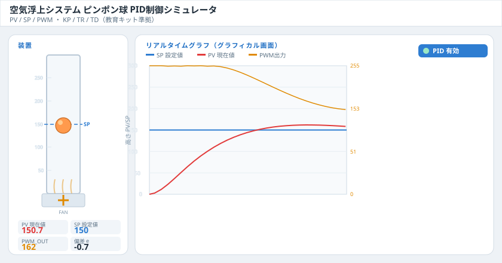
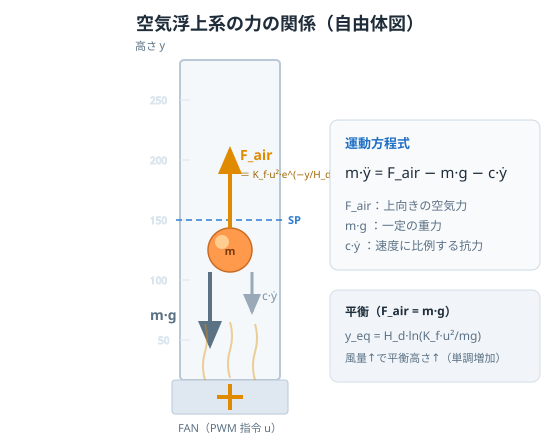

# 空気浮上系の制御ダイナミクス

筒の中のピンポン球を，ファンの風量（PWM 出力）で目標高さに浮かせるフィードバック制御システムの数理モデルと PID 制御の解説です．教育キット（PV / SP / PWM，KP / TR / TD）に準拠しています．

> **対象システム**：ファンで気流を起こし，透明な筒の中のピンポン球を任意の高さに浮上・保持する1自由度の浮上系．ボール位置をセンサで計測（PV）し，目標値（SP）との偏差から PID 制御器がファン指令（PWM）を決定します．



> 上図はブラウザで動作する付属シミュレータ `air_levitation_pid.html` の画面イメージ（目標 `SP=150` への PID 整定応答）．

---

## デモ / 使い方

付属の `air_levitation_pid.html` を **ブラウザで開くだけ**で動作します（外部ライブラリ不要・オフライン可・スマホ/タブレット対応）．

```bash
git clone https://github.com/knjsawada-misclab/Control-study.git
cd Control-study/air_levitation_pid
# air_levitation_pid.html をブラウザで開く（ダブルクリック or 下記）
open air_levitation_pid.html        # macOS
# xdg-open air_levitation_pid.html  # Linux
# start air_levitation_pid.html     # Windows
```

操作のポイント：

- **OFF / P / PI / PID** ボタンで制御則を切り替え（OFF はファン停止 → 球は落下）．
- **SP** スライダーで目標高さを変更．
- **KP / TR / TD** スライダーでゲインを調整（標準形 `Kp / Ki / Kd` への換算値も同時表示）．
- **球を叩く（外乱）** ボタンで外乱を与え，制御の復帰を確認．

---

## 目次

- [1. システム構成](#1-システム構成)
- [2. 物理モデル（プラントのダイナミクス）](#2-物理モデルプラントのダイナミクス)
- [3. 平衡点と開ループ特性](#3-平衡点と開ループ特性)
- [4. 線形化と伝達関数](#4-線形化と伝達関数)
- [5. PID 制御](#5-pid-制御)
- [6. 離散時間実装](#6-離散時間実装)
- [7. 閉ループの振る舞い](#7-閉ループの振る舞い)
- [8. パラメータ一覧](#8-パラメータ一覧)
- [9. 備考](#9-備考)

---

## 1. システム構成


制御器は偏差 `e = SP − PV` を入力に，ファンの回転指令 `u`（PWM）を出力します．ファンが気流を起こして球に上向きの力を与え，球の高さ `y` が変化します．これをセンサで計測してフィードバックする，典型的な1入力1出力（SISO）の閉ループです．

| 信号 | 意味 | 範囲 |
|------|------|------|
| `SP` | 目標高さ（Set Point） | 0〜300 |
| `PV` | 現在の高さ（Process Value） | 0〜300 |
| `PWM` | ファン回転指令（制御入力 `u`） | 0〜255 |
| `e` | 偏差 `SP − PV` | — |

---

## 2. 物理モデル（プラントのダイナミクス）



筒内の球（質量 $m$）には3つの力が働きます．**ファンによる上向きの空気力**，**一定の重力**，そして**速度に比例する抗力**（筒壁との摩擦・空気抵抗をまとめたもの）です．ニュートンの運動方程式は次のとおりです．

$$
m\,\ddot{y} = F_{\text{air}}(u, y) \;-\; m g \;-\; c\,\dot{y}
$$

ここで $y$ は球の高さ，$\dot{y}$ は速度，$\ddot{y}$ は加速度です．

### 空気力モデル

この浮上系の核心は空気力 $F_{\text{air}}$ の非線形性にあります．

$$
F_{\text{air}}(u, y) = K_f \, u_{\text{norm}}^{2} \, \exp\!\left(-\frac{y}{H_d}\right)
$$

$$
u_{\text{norm}} = \frac{\text{PWM}}{255}
$$

この式には2つの重要な非線形性が含まれます．

1. **風量に対して2乗** $u_{\text{norm}}^2$：空気力はファン指令の2乗に比例します（流体の運動量フラックスが流速の2乗に比例することに対応）．
2. **高さに対して指数減衰** $\exp(-y/H_d)$：ファンから出た気流は上昇するほど拡散・減速し，球を押し上げる力が弱まります．$H_d$ は気流の減衰長です．

この「高さが上がると押し上げる力が落ちる」性質が，後述する**自己安定性（復元力）**を生みます．

---

## 3. 平衡点と開ループ特性

定常状態（$\dot{y} = \ddot{y} = 0$）では空気力と重力がつり合います．

$$
F_{\text{air}}(u, y_{\text{eq}}) = m g
\quad\Longrightarrow\quad
K_f \, u_{\text{norm}}^{2}\, \exp\!\left(-\frac{y_{\text{eq}}}{H_d}\right) = m g
$$

これを高さについて解くと，平衡高さが得られます．

$$
y_{\text{eq}} = H_d \,\ln\!\left(\frac{K_f \, u_{\text{norm}}^{2}}{m g}\right)
$$

$y_{\text{eq}}$ は風量 $u_{\text{norm}}$ に対して**単調増加**です．つまり，ファンを強くすると平衡高さは高くなります．

### なぜ制御が必要か

空気力の高さ依存性により，このプラントは**開ループでも一応は安定**です（球が上がりすぎれば力が減って下がり，下がりすぎれば力が増して上がる）．しかし，

- 減衰が弱く応答が遅い，
- 風量を固定しても目標高さに正確には合わない（**定常偏差**が残る），
- 外乱（球を叩く・風の乱れ）に弱い，

という問題があります．これらを解決するために PID フィードバック制御を導入します．

---

## 4. 線形化と伝達関数

平衡点 $(y_{\text{eq}},\ u_{\text{eq}})$ のまわりで微小変動 $\delta y,\ \delta u$ について線形化します．空気力の偏微分は次のようになります．

$$
\left.\frac{\partial F_{\text{air}}}{\partial y}\right|_{\text{eq}}
= -\frac{F_{\text{air}}}{H_d}\bigg|_{\text{eq}}
= -\frac{m g}{H_d}
\equiv -k
$$

$$
\left.\frac{\partial F_{\text{air}}}{\partial u_{\text{norm}}}\right|_{\text{eq}}
= \frac{2 m g}{u_{\text{norm,eq}}}
\equiv b
$$

これを運動方程式に代入すると，**質量‑ばね‑ダンパ**型の安定な2次系が得られます．

$$
m\,\delta\ddot{y} + c\,\delta\dot{y} + k\,\delta y = b\,\delta u_{\text{norm}}
$$

ここで等価ばね定数 $k = mg/H_d$ が，空気力の高さ依存性に由来する**復元力**です．ラプラス変換して入力 $u$ から出力 $y$ への伝達関数を求めると，

$$
G(s) = \frac{Y(s)}{U(s)} = \frac{b}{m s^{2} + c s + k}
$$

標準2次系のパラメータは次のとおりです．

$$
\omega_n = \sqrt{\frac{k}{m}} = \sqrt{\frac{g}{H_d}}
$$

$$
\zeta = \frac{c}{2\sqrt{km}}
$$

固有角周波数 $\omega_n$ は減衰長 $H_d$ が大きいほど小さく（＝応答が遅く）なります．本シミュレータの数値（$g=9.81,\ H_d=120,\ c=0.9,\ m=1$，正規化単位）では $\omega_n \approx 0.29$，$\zeta \approx 1.6$ となり，**減衰の効いた緩慢な応答**であることが分かります．これを速く・正確にするのが制御器の役割です．

---

## 5. PID 制御

制御器は偏差 $e = \text{SP} - \text{PV}$ からファン指令 $u$ を決定します．

### 標準形（Kp / Ki / Kd）

$$
u(t) = K_p\,e(t) + K_i \int_0^t e(\tau)\,d\tau + K_d \frac{d e(t)}{dt}
$$

- **比例 P**：偏差に比例した即応的な押し戻し．大きいほど速いが，大きすぎると振動・不安定化．
- **積分 I**：偏差の累積をゼロにする．**定常偏差を解消**する役割．
- **微分 D**：偏差の変化率を見て先回りし，**オーバーシュート・振動を抑制**する．

### キット形（KP / TR / TD）と換算

教育キット（ScadaBR）は ISA 標準形のパラメータ表記を使います．

$$
u(t) = K_P\left(e + \frac{1}{T_R}\int_0^t e\,d\tau + T_D\,\frac{de}{dt}\right)
$$

両者は次の関係で換算できます．

$$
K_p = K_P, \qquad K_i = \frac{K_P}{T_R}, \qquad K_d = K_P \cdot T_D
$$

| キット表記 | 標準形 | 意味 |
|-----------|--------|------|
| `KP` 比例ゲイン | $K_p = K_P$ | 応答の速さ |
| `TR` 積分時間 | $K_i = K_P / T_R$ | $T_R$ が小さいほど積分が強い |
| `TD` 微分時間 | $K_d = K_P \cdot T_D$ | $T_D$ が大きいほど制振が強い |

---

## 6. 離散時間実装

シミュレータ／実機はサンプリング周期 $\Delta t$ ごとに以下を計算します（本シミュレータでは $\Delta t = 0.02$ s）．実装上は2つの実用的な工夫を入れています．

**(1) 微分は計測値（PV）に対して行う（微分キック回避）**
目標値 SP をステップ変化させた瞬間に微分項が暴れる「微分キック」を防ぐため，$de/dt$ ではなく $-d(\text{PV})/dt$ を用います．

**(2) アンチワインドアップ（条件付き積分）**
出力が PWM の上下限（0〜255）に飽和している間は，偏差を押し込む方向の積分を停止し，積分項の過大な蓄積を防ぎます．

擬似コードは次のとおりです．

```text
e      = SP - PV
deriv  = -(PV - PV_prev) / dt          # 計測値微分
u      = Kp*e + Ki*integ + Kd*deriv
u_sat  = clamp(u, 0, 255)              # PWM 飽和

# アンチワインドアップ：飽和していない，または飽和を解く方向のときだけ積分
if (u == u_sat) or (u > 255 and e < 0) or (u < 0 and e > 0):
    integ += e * dt

PV_prev = PV
出力 PWM <- u_sat
```

P / PI / PID の切り替えは，$K_i$（積分）・$K_d$（微分）項を有効化／無効化することで実現します．OFF はファン停止（$u = 0$）に相当し，球は落下します．

---

## 7. 閉ループの振る舞い

数値シミュレーションで確認できる代表的な挙動です（目標 `SP = 150`）．

| モード | 制御則 | 整定後の PV | 解説 |
|--------|--------|------------:|------|
| **OFF** | ファン停止 | ≈ 0 | 空気力ゼロ，球は落下 |
| **P** | 比例のみ | ≈ 78 | 応答するが**定常偏差**が残る |
| **PI** | 比例＋積分 | ≈ 150 | 積分が偏差を解消し目標に整定 |
| **PID** | 比例＋積分＋微分 | ≈ 150 | 微分が制振し，より滑らかに整定 |

外乱（球を下向きに叩く）を加えても，PI / PID では制御器が自動でファン指令を増やして元の高さへ復帰します．これらは第4章の線形2次系＋PID の理論的予測と一致します．

- **P を上げる** → 応答は速くなるが，上げすぎると振動・不安定化．
- **TR を小さく（I を強く）** → 定常偏差は速く消えるが，過大だと積分振動．
- **TD を大きく（D を強く）** → 振動を抑えるが，過大だと計測ノイズに敏感．

---

## 8. パラメータ一覧

### 物理モデル定数（シミュレータ実装値・正規化単位）

| 記号 | 説明 | 値 |
|------|------|----|
| $m$ | 球の等価質量 | 1.0 |
| $g$ | 重力加速度 | 9.81 |
| $K_f$ | ファン力係数 | 60 |
| $H_d$ | 気流の減衰長 | 120 |
| $c$ | 速度抗力係数 | 0.9 |
| $y_{\text{max}}$ | 筒の有効高さ | 300 |
| $\text{PWM}_{\text{max}}$ | PWM 上限 | 255 |
| $\Delta t$ | 制御・積分周期 | 0.02 s |

### 既定の制御ゲイン

| パラメータ | 値 | 標準形換算 |
|-----------|----|-----------|
| `KP` | 2.0 | $K_p = 2.0$ |
| `TR` | 2.0 | $K_i = K_P/T_R = 1.0$ |
| `TD` | 0.30 | $K_d = K_P \cdot T_D = 0.6$ |

---

## 9. 備考

- 本モデルは制御教育を目的とした**簡易1自由度モデル**であり，流体力学（CFD）レベルの厳密な再現ではありません．気流の渦やボールの回転，筒内の圧力分布などは集約パラメータ（$K_f,\ H_d,\ c$）にまとめています．
- 数値は教材向けに**正規化した無次元量**です．実機に合わせる場合は，ボール質量・筒長・センサスケールから $K_f,\ H_d,\ c$ を同定してください．
- 高さ約 230 以上を目標にすると，平衡に必要な PWM が上限を超えて**飽和**し，目標に届きません．これはアクチュエータ飽和の学習ポイントになります．

---

## リポジトリ構成

```text
Control-study/
├── air_levitation_pid/
│   ├── air_levitation_pid.html   # ブラウザ動作の PID 制御シミュレータ（本体）
│   ├── README.md                 # 本資料（制御ダイナミクスの解説）
│   └── docs/
│       ├── system_schematic.svg  # 浮上系の自由体図
│       └── simulator_preview.svg # シミュレータ画面のプレビュー
├── ...
└── README.md                     # リポジトリ全体の説明
```

## ライセンス

教育・研究目的での利用を想定しています．公開時は用途に応じてライセンス（例：MIT, CC BY 4.0 など）を明記してください．

---

*この資料は付属の HTML シミュレータ（`air_levitation_pid.html`）の数理モデルを記述したものです．*
