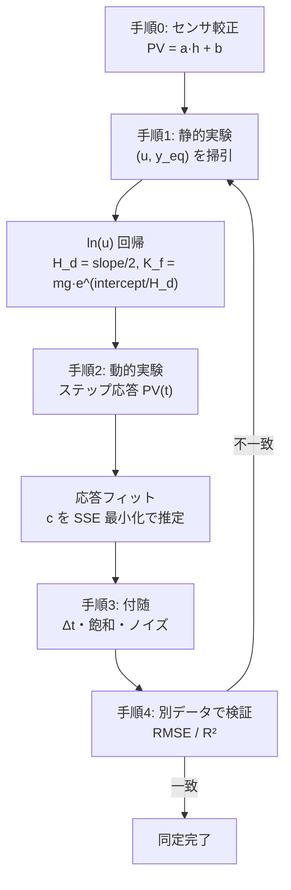

# 空気浮上系 パラメータ同定手順

実機キット（ScadaBR で `PV` / `SP` / `PWM` の時系列が取得可能）から，シミュレータの物理モデルのパラメータを推定（システム同定）する手順です．対象モデルは次のとおりです．

```math
m\ddot{y} = F_{\text{air}}(u, y) - mg - c\dot{y}
```

```math
F_{\text{air}}(u, y) = K_f \,(u_{\text{norm}} - u_0)^2 \exp\!\left(-\frac{y}{H_d}\right)
```

ここで $u_{\text{norm}} = \text{PWM}/255$ ．基本モデルでは $u_0 = 0$ ですが，実機のファンには**デッドバンド**があるため，必要に応じて $u_0$ を加えます．

> 付属の **同定シミュレータ `identification_sim.html`** を使うと，以下の静的・動的実験を仮想プラント上で体験し，推定値と真値を答え合わせできます．

---

## 同定するパラメータ

| 記号 | 内容 | 推定方法 | 区分 |
| --- | --- | --- | --- |
| $m$ | 球の質量 | 秤で直接測定（≈2.7 g） | 既知 |
| $g$ | 重力加速度 | 定数 9.81 | 既知 |
| $a, b$ | センサ較正係数 `PV = a·h + b` | 既知高さでの計測（手順0） | 静的 |
| $K_f$ | ファン力係数 | 静的実験＋直線回帰（手順1） | 静的 |
| $H_d$ | 気流の減衰長 | 静的実験＋直線回帰（手順1） | 静的 |
| $u_0$ | ファンのデッドバンド | 静的実験（発展） | 静的 |
| $c$ | 速度抗力係数 | 動的実験＋応答フィット（手順2） | 動的 |
| $\Delta t$ | 制御周期 | PLC スキャン周期（既知） | 既知 |
| $\sigma$ | 計測ノイズ標準偏差 | 定常 PV の統計（手順3） | 付随 |

---

## 手順0：センサ較正（最初に必ず実施）

`PV` はセンサ生値なので，物理高さ $h$ との対応を先に求めます．

1. PID を切り，ボールを筒の目盛り上の既知高さ $h_1, h_2, \dots$ に固定（指やストッパで保持）．
2. 各高さで `PV` を記録．
3. $(h_i, \text{PV}_i)$ を最小二乗で直線 $\text{PV} = a h + b$ にフィット．
4. 以降，計測した PV を $h = (\text{PV} - b)/a$ で物理高さに変換して使う．

センサが非線形なら多項式や区分線形で較正します．

---

## 手順1：静的実験 → $K_f$ と $H_d$ （閉形式）

平衡点では空気力と重力がつり合います．

```math
K_f \, u_{\text{norm}}^2 \exp\!\left(-\frac{y_{\text{eq}}}{H_d}\right) = mg
```

これを変形すると， $\ln u_{\text{norm}}$ について**線形**になります．

```math
y_{\text{eq}} = H_d\left[\ln\!\left(\frac{K_f}{mg}\right) + 2\ln u_{\text{norm}}\right]
```

### 実験

1. PID を切り，ファンを**固定 PWM** で回す．
2. ボールが静止したら平衡高さ $y_{\text{eq}}$ を記録．
3. PWM を範囲全体で変えながら 8〜12 点を取得（各点で数回平均するとよい）．

### 回帰

$X_i = \ln u_{\text{norm},i}$ ， $Y_i = y_{\text{eq},i}$ として最小二乗直線をあてはめます．

```math
\text{slope} = \frac{\sum (X_i - \bar{X})(Y_i - \bar{Y})}{\sum (X_i - \bar{X})^2}, \qquad \text{intercept} = \bar{Y} - \text{slope}\cdot\bar{X}
```

傾きと切片から，パラメータが一意に求まります．

```math
H_d = \frac{\text{slope}}{2}, \qquad K_f = mg \cdot \exp\!\left(\frac{\text{intercept}}{H_d}\right)
```

### データ記録テンプレート

| PWM | $u_{\text{norm}}$ | $y_{\text{eq}}$ | $\ln u_{\text{norm}}$ |
| ---: | ---: | ---: | ---: |
| 130 | 0.510 | … | −0.673 |
| 150 | 0.588 | … | −0.531 |
| 170 | 0.667 | … | −0.405 |
| … | … | … | … |

### 発展：デッドバンド $u_0$

低 PWM 側で直線から外れる場合， $F = K_f(u_{\text{norm}} - u_0)^2 e^{-y/H_d}$ とし， $X_i = \ln(u_{\text{norm},i} - u_0)$ に置き換えて， $u_0$ を変えながら回帰の決定係数 $R^2$ が最大になる $u_0$ を選びます（1次元探索）．

---

## 手順2：動的実験 → 減衰 $c$

手順1で等価ばね定数 $k = mg/H_d$ が決まるので，残るは $c$ です．平衡点まわりは2次系になります．

```math
G(s) = \frac{b}{ms^2 + cs + k}, \qquad \omega_n = \sqrt{k/m}, \qquad \zeta = \frac{c}{2\sqrt{km}}
```

次のいずれかで $c$ を求めます．

- **方法A（応答重ね描きフィット）**：ある PWM から別の PWM へステップ変化させ， $\text{PV}(t)$ を記録．推定済み $K_f, H_d$ を使ったモデルの応答を重ね， $c$ を調整して実測に一致させる（残差二乗和 SSE 最小化）．**過減衰でも使えるため推奨．**
- **方法B（過渡特性）**：振動が出る場合は，オーバーシュート量から $\zeta$ ，振動周期から $\omega_n$ を読み， $c = 2\zeta\sqrt{km}$ ．
- **方法C（自由応答）**：ボールを軽く叩き，減衰の対数減衰率から $\zeta$ を推定．

> 本系は既定パラメータでは**過減衰**（ $\zeta > 1$ ）で振動しないため，方法A（重ね描きフィット）が最も確実です．

---

## 手順3：付随パラメータ

- **制御周期 $\Delta t$** ：PLC のスキャン周期（既知）．
- **アクチュエータ飽和**：PWM 上下限（0〜255）と，それに対応する到達可能な最大・最小高さを記録．
- **計測ノイズ $\sigma$** ：定常状態の `PV` を数十秒記録し標準偏差を計算．微分ゲイン $D$ の上限やローパスフィルタ時定数の目安にする．

---

## 手順4：検証

同定に使っていない**別の PWM パターン**（検証用データ）で，同定モデルのシミュレーションと実測を重ね描きし，誤差を評価します．合わない場合は $u_0$ やセンサ非線形性を見直します．指標には平均二乗誤差（RMSE）や決定係数 $R^2$ を使います．

---

## 全体フロー



---

## チェックリスト

- [ ] センサを既知高さで較正した（手順0）
- [ ] 静的データを範囲全体で 8 点以上取得した（手順1）
- [ ] $y_{\text{eq}}$ vs $\ln u_{\text{norm}}$ が直線になることを確認した
- [ ] $H_d, K_f$ を回帰から算出した
- [ ] ステップ応答を記録し $c$ をフィットした（手順2）
- [ ] 別データで検証した（手順4）

---

*関連ファイル：制御モデルの解説は [`air_levitation_pid_guide.md`](air_levitation_pid_guide.md)，同定実験ツールは `identification_sim.html`，制御シミュレータは `air_levitation_pid.html`．*
